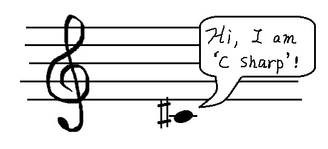

# 0.1 嘛是C#？

[目录](/zh-Contents.md) | [第0章](../zh-Chp_0.md)

## 你好，C#

C#是一种流行的编程语言。C#的英文念做“C-Sharp”，你也可以叫它C井。按照乐理来说，“#”表示附着的音符要升高半音，所以C#也可以叫做升C。无论哪种叫法都没有对错之分，只要在交流中能让别人理解即可，不需要纠结读音。

> [!TIP]
> 很多著名音乐作品都是升c小调的，比如贝多芬的《月光奏鸣曲》、肖邦的《第20号夜曲》和《幻想即兴曲》，还有李斯特的《第2号匈牙利狂想曲》等。

> 只要认真学习，你也能用C#语言写出伟大的项目！

其实还有一种有趣的说法：把“#”号拆成4瓣，就是4个“+”号。所以C#也可以看成“C++++”！？也许你之前听过C++，它也是一种广为使用的编程语言。C++可以被视为C语言的进化版，类似的，C#也和C语言和C++有很多相似之处。因此，之前学过C或C++将会很有帮助，但没学过也完全不要紧啦。

同时，与C/C++相比，C#也有很多独特的功能，提供了更加简明易用的语法。在后续章节中将会揭示这点。

## 我要学C#吗？

如果搜“最流行的编程语言”，你会立刻被各种榜单和排行搞花眼。但是别被数据迷惑了！关键不是跟随大众，而是在选择一种最符合你的需求的语言。

问问你自己打算做什么？每种语言都有自己的长处。如果你对数据科学和机器学习感兴趣，就去学python；如果你想做个炫酷的网站，HTML/CSS/JavaScript可能是更好的选择；如果你想运营一个服务器，那么就要学Bash或者Shell了。

**如果你的开发目标是这些，那么C#是一个不错的选择：**

+ Windows 桌面/网页/移动端平台的应用，
    - 例如 [MS Office](https://www.office.com/), [Visual Studio](https://visualstudio.microsoft.com/), 和 [Stack Overflow](https://stackoverflow.com/)这样的。
+ 游戏开发，特别是和Unity等引擎结合时，
    - 例如 [口袋妖怪：Go](https://pokemongolive.com/), [城市：天际线](https://www.paradoxinteractive.com/games/cities-skylines-ii/about), [泰拉瑞亚](https://www.terraria.org/), 和 [星露谷物语](https://www.stardewvalley.net/)。
+ 物联网/嵌入式应用，还有
+ 小工具。

## 怎么学C#

**跟着本教程一起学，然后练习。**如果你已经读过前面的说明，也决定了要学C#，那我们激动人心的代码之旅将在下一节正式开始！接下来，你会通过阅读教程和在你的设备上调试代码来学习C#。好记性不如烂笔头（键帽）。自己把代码打一遍会比复制粘贴记得牢。

在章节之间还会有一些**小项目**供你尝试。你得综合所学知识才能动手解决。毕竟老是看文字也太无聊了。做一些有意思的东西，既能记录你的进步，又能收获成就感！

**-“但AI啥都能干！”** 

-现在还不是。有时AI生成的答案会有错误。如果你会C#，就能快速找到这些错误并修正它们。而且，如果AI的数据库没有及时更新，你可能会得到过时甚至已经弃用的结果，带来安全隐患等。此外，就像创作艺术作品，编程也是一种展示人类创造力的过程。对我来说，AI是得力助手，但我也享受亲手创造东西的感觉。对了，当你在编程时遇到解决不了的问题时，AI可以助你一臂之力。

好了，开始我们的旅途吧！

[>>下一节](../Lesson0_2/zh-L0_2.md)