# 0.2 搭建跑“码”场

---

[目录](/Contents.md) | [第1章](../Chatper_1/Chp_1.md)


## 前置任务

- 获得一台Windows/Mac/Linux OS系统的电脑;
    - 下面的例子是用 Windows 11 (x64)展示的。
- 必要的储存空间。具体查看你选择的开发平台的系统要求。

## 安装Visual Studio 或 Visual Studio Code

要在你的设备上运行C#代码，你需要先给你的程序搭建一个“运动场”，也就是“开发环境”。我们在这个环境里设计、编写和测试我们的项目。


[Visual Studio](#用-visual-studio) 和 [Visual Studio Code](#用-visual-studio-code) 都可以。但是如果你的系统是Linux或者储存空间不充足，推荐用Visual Studio Code。

> [!IMPORTANT]
> 开始下载之前，先检查你要下载的版本是不是和你的操作系统和架构兼容。

### 用 Visual Studio

#### 1. 安装 Visual Studio

浏览器搜索“Visual Studio”（注意看域名是microsoft.com，不要进错第三方广告网站了）或点下面链接。

- [Visual Studio 下载](https://visualstudio.microsoft.com/zh-hans/vs/)

然后看这个 [安装说明](https://learn.microsoft.com/zh-cn/visualstudio/install/install-visual-studio?view=vs-2022)。 **安装时会让你选工作负载，别忘了勾选“.NET桌面开发”**。

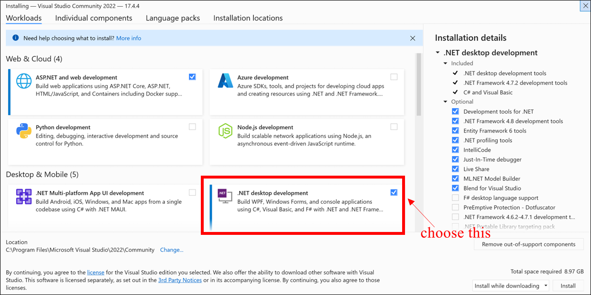


#### 2. 配置开发环境

把一切都搞定以后，打开Visual Studio。选择你喜欢的配色方案。暗色主题可以减轻眼睛疲劳，还可以起到一个很帅的作用。 :smile: 

接下来，新建一个C#项目，测试你的开发环境能不能工作。点击“创建新项目”，然后给测试项目随便起个名（不推荐使用非英文字符）：

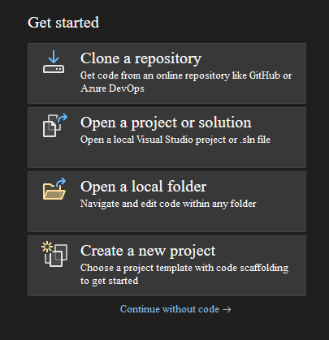

然后选择**带有C#标签**的控制台应用选项：

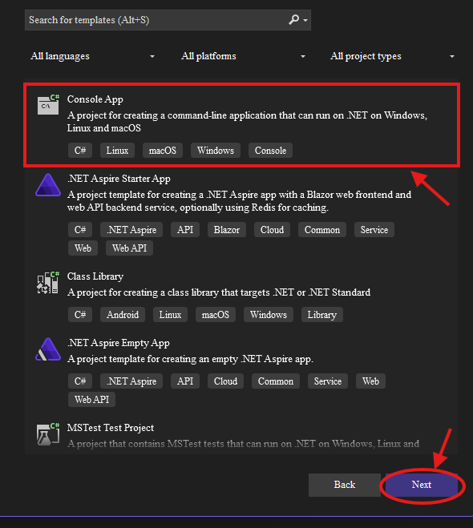

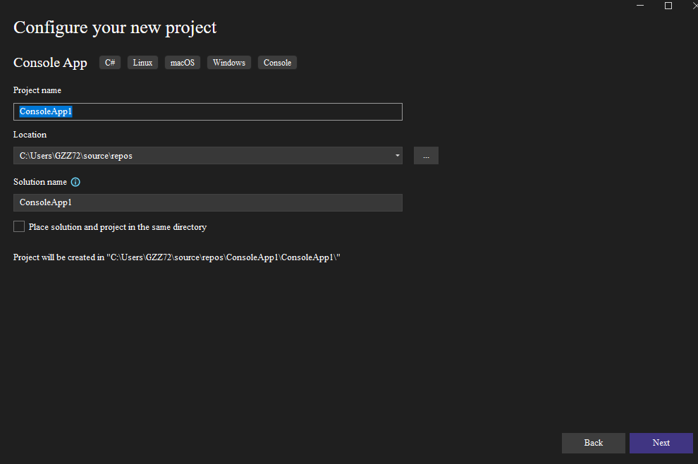

> [!NOTE]
> 注意到，你可以选择.NET框架的版本。这就说明你可以在你的设备上安装不止一个.NET版本，然后为每个项目指定需要的版本。
> 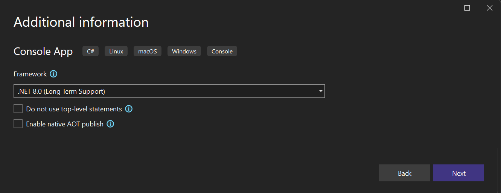

最后你会看到像下图这样的窗口。点击屏幕上方中间的绿色三角形按钮，等待几秒。一个黑色的窗口弹出，写着“Hello world”？！太棒了，这是你的第一个app！

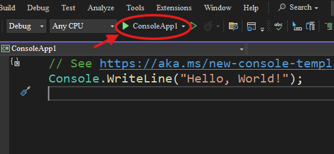

[>>下一节](../Lesson0_3/L0_3.md)

### 用 Visual Studio Code

#### 1. 安装 Visual Studio Code

浏览器搜“Visual Studio Code”（注意别进第三方广告网站了），或者直接点下面的链接。 

- [Visual Studio Code 下载](https://code.visualstudio.com/download)

安装好后打开Visual Studio Code，在左侧边栏中找到扩展图标（形状像俄罗斯方块），搜索“简体中文”，安装地球仪图标的扩展。安装好后重启软件，界面就是中文了。

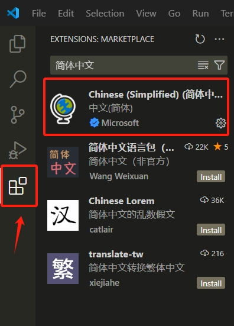

#### 2. 安装 .NET SDK

浏览器搜“.NET SDK” 或者点下面链接。

- [.NET SDK 下载](https://dotnet.microsoft.com/zh-cn/download)

如果你看到像这样的网页，就点**下载 .NET SDK**。

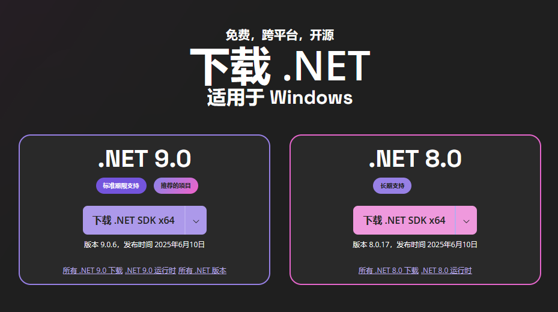

> [!TIP]
> 什么是“标准期限支持”和“长期支持”？
> 标准期限支持的版本将在18个月内提供修bug、添加安全补丁等维护服务，长期支持版本则是3年时间。对于追求稳定性的长周期的项目来说，长期支持版本是更好的选择。但对于我们初学者来说，选哪个无所谓。

如果系统或者架构和你的需求不符，就点**所有.NET下载**，找到合适的版本。

> [!NOTE]
> .NET SDK 已经包括 .NET Runtime, ASP .NET Core Runtime, 和 .NET Desktop Runtime。所以不必单独下载它们。
> 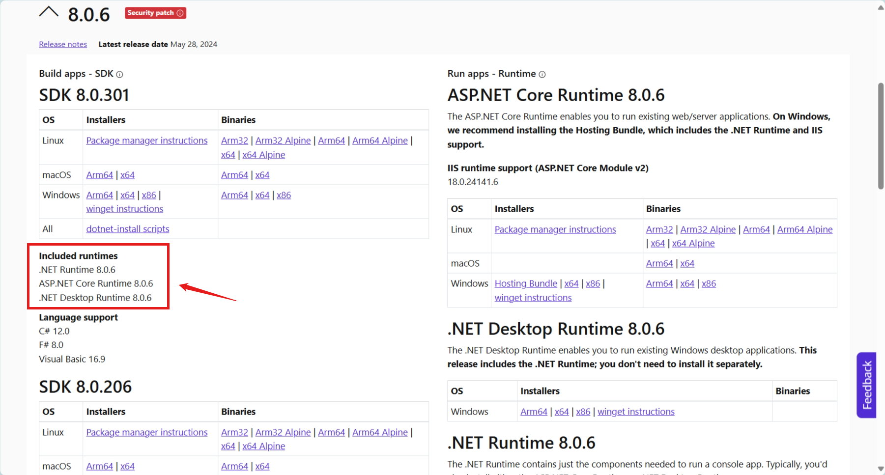

有时你会需要一个不是最新版的特定版本。这时可以点**所有.NET版本**，寻找历史版本。

> [!TIP]
> -我能在我的设备上安装多个.NET版本吗？
> -当然！但是它们不能同时工作。你将会在[后面]()学会如何指定需要的版本。

#### 3. 配置开发环境

打开Visual Studio Code，然后在欢迎页面点“打开文件夹...”。选择一个存放你的编程文件的位置。之后点下图所示的“新建文件”按钮。

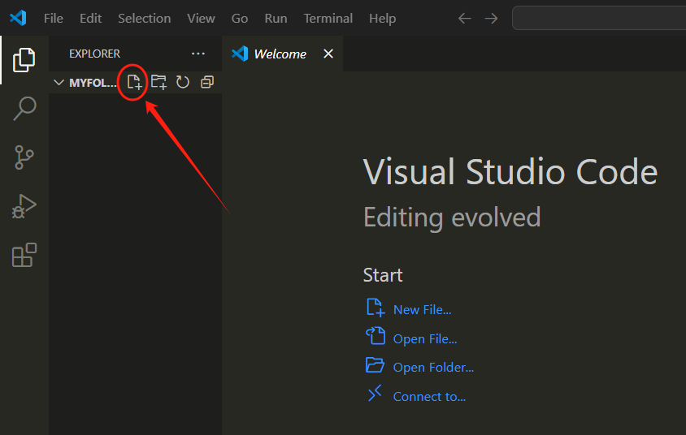

把新建的文件以“.cs”为后缀命名。这里我命名为“test.cs”。没错，cs表示这是一个C#源代码文件。

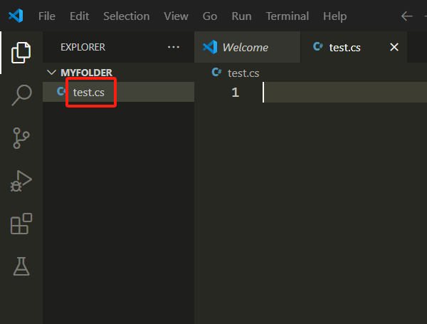

查看屏幕右下角。软件此时会推荐你安装C#扩展包。点击安装，然后会下载几个包。左侧边栏打开扩展（还是俄罗斯方块图标）就可以看见它们。

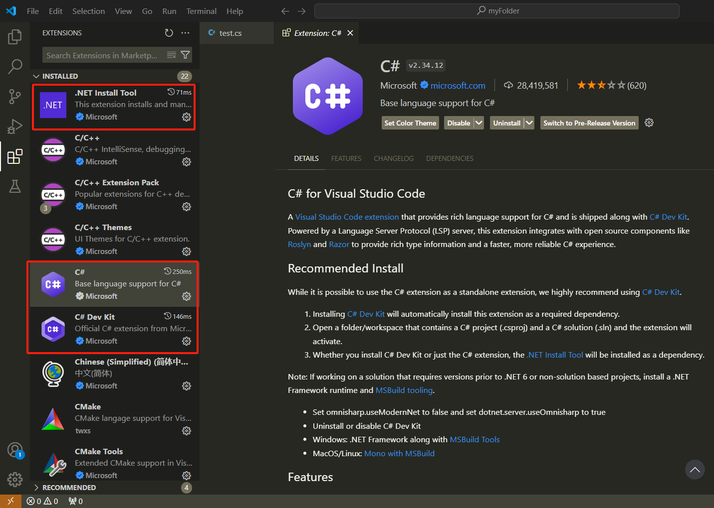

你也可以手动安装它们。这些包分别是：C#、 C# Dev Kit、 .NET Install Tool、和 IntelliCode for C# Dev Kit。在扩展面板中搜索并安装它们。

现在，删掉你刚刚创建的.cs文件。按 `ctrl`+`shift`+`P` 或者在屏幕上方中间的搜索栏输入 `>`。输入“.NET: New Project”，选择下方列出的这个选项。 

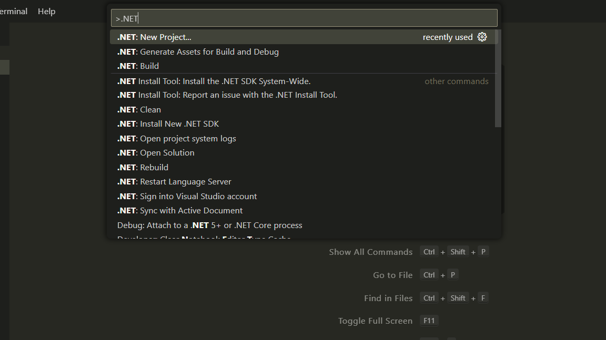

接着输入“Console App”然后选择对应选项。跟着指引选择新建控制台应用的名称与位置。

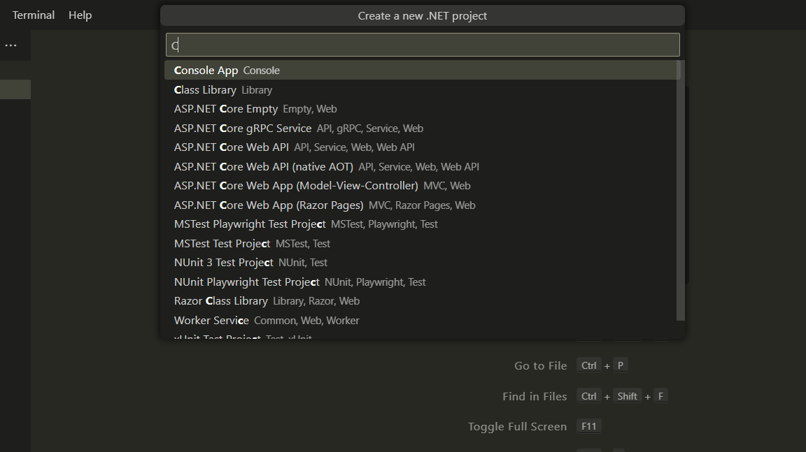

打开新建项目中的“Program.cs”文件，按`F5`。

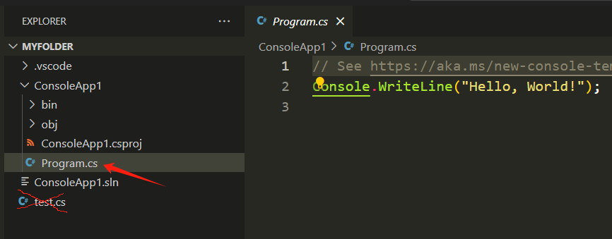

如果下方“终端”内显示类似这样的信息，说明你的配置成功了！这是第一个里程碑！

```Shell
PS myFolder>  & 'Users\.vscode\extensions\ms-dotnettools.csharp-2.34.12-win32-x64\.debugger\x86_64\vsdbg.exe' '--interpreter=vscode' '--connection=xxxx' 
Hello, World!
```

> [!TIP]
> -为什么VS Code的配置过程比VS麻烦？
> -因为VS Code只是一个文本编辑器。拿电脑做比，VS像买了一台整机，而VS Code类似买一块主板，你得自己接入其他组件才能让它工作（比如我们刚刚用到的 .NET SDK）。
> 什么？！更不懂了？那么，VS Code是你亲自下厨，而VS是预制菜！

> 今后的教程将使用Visual Studio讲解。~~因为作者很懒。~~

[>>下一节](../Lesson0_3/L0_3.md)