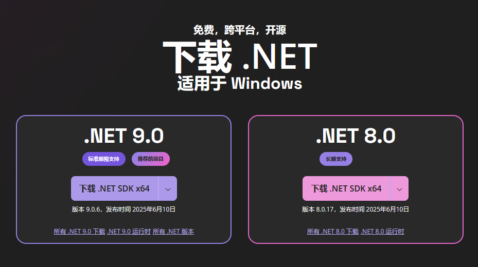
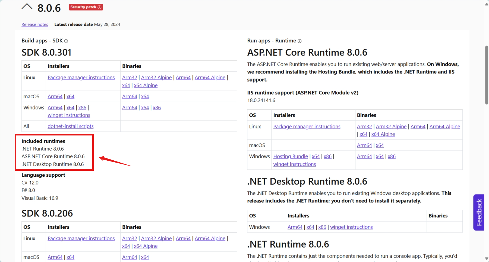

## 0.2 搭建跑“码”场

<hr>

[目录](/zh-Contents.md) | [第1章](../Chatper_1/zh-Chp_1.md)

<!--TODO: VS和VSC下载网址换成中文的，插图改中文。-->

### 前置任务

- 获得Windows/Mac/Linux OS系统的电脑;
    - 下面的例子是用 Windows 11 (x64)展示的。
- 储存空间。具体查看你选择的开发平台的系统要求。

### 安装Visual Studio 或 Visual Studio Code

要在你的设备上跑C#代码，你需要先给你的程序搭建一个“运动场”，也就是“开发环境”。我们在这个环境里设计、编写和测试我们的项目。


[Visual Studio](./zh-L0_2.md/#用-visual-studio) 和 [Visual Studio Code](./zh-L0_2.md/#用-visual-studio-code) 都可以。但是如果你的系统是Linux或者储存空间不充足，推荐用Visual Studio Code。

> [!IMPORTANT]
> 开始下载之前，先检查你要下载的版本是不是和你的操作系统和架构兼容。

### 用 Visual Studio

#### 1. 安装 Visual Studio

浏览器搜索“Visual Studio”（注意看域名是microsoft，不要进错第三方广告网站了）或点下面链接。

- [Visual Studio 下载](https://visualstudio.microsoft.com/zh-hans/vs/)

然后看这个 [安装说明](https://learn.microsoft.com/zh-cn/visualstudio/install/install-visual-studio?view=vs-2022). **安装时会让你选工作负载，别忘了勾选“.NET桌面开发”**


#### 2. 配置开发环境

把一切都搞定以后，打开Visual Studio。选择你喜欢的配色方案。暗色主题可以减轻眼睛疲劳，还可以起到一个很帅的作用。:smile: 

接下来，新建一个C#项目，测试你的开发环境能不能工作。点击“创建新项目”，然后给测试项目随便起个名（不推荐使用非英文字符）。


> [!NOTE]
> 注意到，你可以选择.NET框架的版本。这说明你可以在你的设备上安装不止一个.NET版本，然后为每个项目指定需要的版本。
> 

最后你会看到像下图这样的窗口。点击屏幕上方中间的绿色三角形按钮，等待几秒。一个黑色的窗口弹出，写着“Hello world”？！太棒了，这是你的第一个app！


[>>下一节](../Lesson0_3/zh-L0_3.md)

### 用 Visual Studio Code

#### 1. 安装 Visual Studio Code

浏览器搜“Visual Studio Code”（注意别进第三方广告网站了），或者直接点下面的链接。 

- [Visual Studio Code 下载](https://code.visualstudio.com/download)

安装好后打开Visual Studio Code，在左侧边栏中找到扩展图标（形状像俄罗斯方块），搜索“简体中文”，安装地球仪图标的扩展。安装好后重启软件，界面就是中文了。


#### 2. 安装 .NET SDK

浏览器搜“.NET SDK” 或者点下面链接。

- [.NET SDK 下载](https://dotnet.microsoft.com/zh-cn/download)

如果你看到像这样的网页，就点中间的**下载 .NET SDK**。



如果系统或者架构和你的需求不符，就点**所有.NET下载**，找到合适的版本。

> [!NOTE]
> .NET SDK 已经包括 .NET Runtime, ASP .NET Core Runtime, 和 .NET Desktop Runtime。所以不必单独下载它们。
> 

有时你会需要一个不是最新版的特定版本。这时可以点**所有.NET版本**，寻找历史版本。

> [!TIPS]
> -我能在我的设备上安装多个.NET版本吗？
> -当然！但是它们不能同时工作。你将会在[后面]()学会如何指定需要的版本。

#### 3. 配置开发环境

打开Visual Studio Code，然后在欢迎页面点“打开文件夹...”。选择一个存放你的编程文件的位置。之后点下图所示的“新建文件”按钮。


把新建的文件以“.cs”为后缀命名。这里我命名为“test.cs”。没错，cs表示这是一个C#源代码文件。


查看屏幕右下角。软件此时会推荐你安装C#扩展包。点击安装，然后会下载几个包。左侧边栏打开扩展（还是俄罗斯方块图标）就可以看见它们。


你也可以手动安装它们。这些包分别是：C#、 C# Dev Kit、 .NET Install Tool、和 IntelliCode for C# Dev Kit。

现在，删掉你刚刚创建的.cs文件。按 `ctrl`+`shift`+`P` 或者在屏幕上方中间的搜索栏输入 `>`。输入“.NET: New Project”，选择下方列出的这个选项。 


接着输入“Console App”然后选择对应选项。跟着指引选择新建控制台应用的名称与位置。


打开新建项目中的“Program.cs”文件，按`F5`。


如果下方“终端”内显示类似这样的信息，说明你的配置成功了！这是第一个里程碑！

```Shell
PS myFolder>  & 'Users\.vscode\extensions\ms-dotnettools.csharp-2.34.12-win32-x64\.debugger\x86_64\vsdbg.exe' '--interpreter=vscode' '--connection=xxxx' 
Hello, World!
```

[>>下一节](../Lesson0_3/zh-L0_3.md)

> [!TIPS]
> -为什么VS Code的配置过程比VS麻烦？
> -因为VS Code只是一个文本编辑器。拿电脑做比，VS像一台整机，而VS Code类似一块主板，你得自己接入其他组件才能让它工作（比如我们刚刚用到的 .NET SDK）。
-Because VS Code is a mere text editor. Take PC as an instance, VS is somewhat like a whole machine while VS Code is a mother board, you have to link it to other components(like .NET SDK we just used) to make it works.