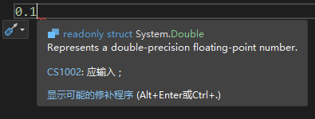

# 1.2 浮点数

---

[目录](/Contents.md) | [第1章](../Chp_1.md)

## 浮点数的类型、声明与赋值

哦！看这个小标题👆，居然要一口气讲3个东西！看来有了上一节的基础，本章的介绍可以进入快车道了。

1=1×1对吗？什么？太简单了？那1=0.1×10=10×0.1对吗？你问我是不是小学生？

好吧，请观察下面的等式：

```
1 = 0.001×1000
  =  0.01×100
  =   0.1×10
  =     1×1
  =    10×0.1
  =   100×0.01
  =  1000×0.001
```

如果写成科学计数法，那就是

```
1 =    0.001×10^3
  =    0.01 ×10^2
  =    0.1  ×10^1
  =    1.0  ×10^0
  =   10.0  ×10^-1
  =  100.0  ×10^-2
  = 1000.0  ×10^-3
```
> [!IMPORTANT]
> 在数学公式中，我们用 `a^b` 来表示a<sup>b</sup>。但是在C#编程中的正确写法应该是 `Math.Pow(a, b)`，这个符号 `^` 起别的作用，一定不要混淆哦。

从上面这个数字游戏可以看出，科学计数法通过改变乘号右边10的指数，可以让乘号左边的数字的小数点动来动去。与普通写法相比，小数点的位置好像在随意浮动一般，因此叫它“**浮点数**”（Floating-point Number）。相对的，普通写法的数字就叫做“定点数”了。整数可以写成定点数也可以写成浮点数（比如刚刚展示的数字1），小数也是如此。**不要因为我们通常把小数写成浮点数，就把浮点数等同于小数。**

C#提供了两种二进制浮点数 `float` 和 `double`。所谓“二进制浮点数”就是在刚刚的案例中，把科学计数法由以10为底改为以2为底。那以10为底的呢，就顺理成章的叫做“十进制浮点数”了咯。在C#中，`decimal`类型就是一种十进制浮点数。看看它们的声明方法：

```C#
float a;
double b, c;
decimal d;
```

乖乖，和上一节的整数类型变量声明方法一模一样！事实上，这也适用于本章要讲的其他类型数据的声明。浮点数常数的声明和初始化也可以通过上一节的知识举一反三！但是浮点数在赋值方面有一些不同的特点。在你的代码文件中随便输入一个小数，就像这样：

```C#
0.1
```

此时可能有错误提示，但无需理会。请把鼠标指针移动到0.1上停住，等待一会，你会看到下面这样的提示：



也许其他说明我们看不懂，但“double”可是写的明明白白！也就是说，我们普通输入的小数，C#会默认它是`double`类型。上一节我们说到过，不能随便给某个类型的实例赋一个不相符类型的值对不对？所以可以预测，把普通输入的小数赋给`double`变量没事，但是赋给`float`、`decimal`，甚至`int`类型的变量就会有问题了。动手测试一下吧：

```C#
float a = 0.1;
double b = 0.1;
decimal c = 0.000_1;//小数的数位也可以用下划线分隔
int d = 0.1;
```

果然——除了变量`b`以外都报错了。等等，刚刚说“普通输入的小数”，那怎么样的是不普通的小数呢？请看下面：

```C#
float a = 0.1f;
double b = 0.1d;
decimal c = 0.000_1m;
```

改成这样以后，错误都消失了！没错，为了区分这3种浮点数类型，需要在它们后面加上特定的字母：`f`或`F`表示`float`类型，`d`或`D`表示`double`类型，`m`或`M`表示`decimal`类型。如果不加字母就会被认为是`double`。

> 为什么`decimal`是字母m？呃，据说首先是d被`double`占用了，然后设计者选择了比较独特的m。

上一节我们知道了C#提供的不同整数类型有不同的取值范围、占用的空间大小也不一样。那么，这3种浮点数是不是也有这样的区别呢？正是！

| 类型 | 范围 | 占用空间 | 精度 |
| --- | --- | --- | --- |
|float|±1.5x10<sup>−45</sup> 到 ±3.4x10<sup>38</sup>|32 bit|6~9位数字|
|double|±5.0×10<sup>−324</sup> 到 ±1.7×10<sup>308</sup>|64 bit|15~17位数字|
|decimal|±1.0x10<sup>-28</sup> 到 ±7.9228x10<sup>28</sup>|16 byte|28~29位数字|

与整数类型相比，浮点数的表示范围显然要大很多，占用的空间也比较大……精度？这是什么？

请问你知道1/3写成小数是多少吗？0.333333333……无限循环下去对不对？那你知道1/3在3进制里面是多少吗？

(1/3)<sub>10</sub> = (1 × 3<sup>-1</sup>)<sub>10</sub> = (10<sup>-1</sup>)<sub>3</sub> = (0.1)<sub>3</sub>

在10进制里面的无限循环小数在3进制里面居然只是0.1？！难道有限小数转换进制之后有可能变成无限循环小数？是的！十进制里的0.1转换成二进制以后，就会变成0.0001100110011……这样的无限循环小数。虽然它们的位数是无限的，可是你的计算机的内存是有限的！于是计算机说，差不多得了吧，就在某个位置截断了这些小数。

可想而知，这样一定会造成计算误差！请尝试运行下面的代码：

```C#
Console.WriteLine(0.1 + 0.2);
```

真是笑掉大牙了，计算机连这么简单的算术都做不对。多出来的0.00000000000000004就来源于进制转换造成的计算误差。

> [!TIP]
> 为什么`0.1f+0.2f`能算“对”？-其实结果也是不准确的，只是`float`类型的精度没达到能显示误差的数位，因此巧合地产生了0.3的假象。

使用十进制浮点数`decimal`类型就可以避免进制转换带来的误差。`decimal`被广泛用于计算精度要求高的场合，比如银行、金融业等（难道m后缀是money？）。有得必有失，`decimal`数值范围较小、占用空间较大、运算较慢就是计算机模拟十进制的代价。

`float`，`double`和`decimal`之间到底如何选择？和上一节说的一样：根据你的需求。通常`double`就足够了（这也说明了为什么输入无后缀小数默认是`double`），除非你的作品因为判定不准而差评如潮，这时就要考虑使用`decimal`了。

## 类型转换

你一定还记得，浮点数不等于小数。所以，当我们给浮点类型的实例赋一个整数值时，也应该加上相应的后缀，否则就会引发错误对吧？像下面这样：

```C#
float a = 100;
double b = 666;
decimal c = 20;
```

什——么——居然没有报错！？究竟是怎么回事？为什么小数需要加后缀区分，而整数无论是在上一节的定点整数类型还是本节介绍的3种浮点类型都可以直接赋值？

[>>下一节](../Lesson1_3/L1_3.md)