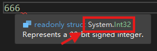
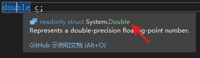

# 1.2 浮点数

---

[目录](/Contents.md) | [第1章](../Chp_1.md)

## 浮点数的类型、声明与赋值

哦！看这个小标题👆，居然要一口气讲3个东西！看来有了上一节的基础，本章的介绍可以进入快车道了。

1=1×1对吗？什么？太简单了？那1=0.1×10=10×0.1对吗？你问我是不是小学生？

好吧，请观察下面的等式：

$$
\begin{align*}
1 &= 0.001 \times 1000 \\
  &= 0.01 \times 100 \\
  &= 0.1 \times 10 \\
  &= 1 \times 1 \\
  &= 10 \times 0.1 \\
  &= 100 \times 0.01 \\
  &= 1000 \times 0.001
\end{align*}
$$

如果写成科学计数法，那就是

$$
\begin{align*}
1 &= 0.001 \times 10^3 \\
  &= 0.01 \times 10^2 \\
  &= 0.1 \times 10^1 \\
  &= 1.0 \times 10^0 \\
  &= 10.0 \times 10^{-1} \\
  &= 100.0 \times 10^{-2} \\
  &= 1000.0 \times 10^{-3}
\end{align*}
$$


> [!IMPORTANT]
> 在数学公式中，我们有时用 `a^b` 来表示a<sup>b</sup>。但是在C#编程中的正确写法应该是 `Math.Pow(a, b)`，这个符号 `^` 起别的作用，一定不要混淆哦。

从上面这个数字游戏可以看出，科学计数法通过改变乘号右边10的指数，可以让乘号左边的数字的小数点动来动去。与普通写法相比，小数点的位置好像在随意浮动一般，因此叫它“**浮点数**”（Floating-point Number）。相对的，普通写法的数字就叫做“定点数”了。整数可以写成定点数也可以写成浮点数（比如刚刚展示的数字1），小数也是如此。**不要因为我们通常把小数写成浮点数，就把浮点数等同于小数**。

C#提供了两种二进制浮点数 `float` 和 `double`。所谓“二进制浮点数”就是在刚刚的案例中，把科学计数法由以10为底改为以2为底。那以10为底的呢，就顺理成章的叫做“十进制浮点数”了咯。在C#中，`decimal`类型就是一种十进制浮点数。看看它们的声明方法：

```C#
float a;
double b, c;
decimal d;
```

乖乖，和上一节的整数类型变量声明方法一模一样！事实上，这也适用于本章要讲的其他类型数据的声明。浮点数常数的声明和初始化也可以通过上一节的知识举一反三！但是浮点数在赋值方面有一些不同的特点。在你的代码文件中随便输入一个小数，就像这样：

```C#
0.1
```

此时可能有错误提示，但无需理会。请把鼠标指针移动到0.1上停住，等待一会，你会看到下面这样的提示：


也许其他说明我们看不懂，但“double”可是写的明明白白！也就是说，我们普通输入的小数，C#会默认它是`double`类型。上一节我们说到过，不能随便给某个类型的实例赋一个不相符类型的值对不对？所以可以预测，把普通输入的小数赋给`double`变量没事，但是赋给`float`、`decimal`，甚至`int`类型的变量就会有问题了。动手测试一下吧：

```C#
float a = 0.1;
double b = 0.1;
decimal c = 0.000_1;//小数的数位也可以用下划线分隔
int d = 0.1;
```

果然——除了变量`b`以外都报错了。等等，刚刚说“普通输入的小数”，那怎么样的是不普通的小数呢？请看下面：

```C#
float a = 0.1f;
double b = 0.1d;
decimal c = 0.000_1m;
```

改成这样以后，错误都消失了！没错，为了区分这3种浮点数类型，需要在它们后面加上特定的字母：`f`或`F`表示`float`类型，`d`或`D`表示`double`类型，`m`或`M`表示`decimal`类型。如果不加字母就会被认为是`double`。

> 为什么`decimal`是字母m？呃，据说首先是d被`double`占用了，然后设计者选择了比较独特的m。

上一节我们知道了C#提供的不同整数类型有不同的取值范围、占用的空间大小也不一样。那么，这3种浮点数是不是也有这样的区别呢？正是！

| 类型 | 范围 | 占用空间 | 精度 |
| --- | --- | --- | --- |
|float|±1.5x10<sup>−45</sup> 到 ±3.4x10<sup>38</sup>|32 bit|6~9位数字|
|double|±5.0×10<sup>−324</sup> 到 ±1.7×10<sup>308</sup>|64 bit|15~17位数字|
|decimal|±1.0x10<sup>-28</sup> 到 ±7.9228x10<sup>28</sup>|16 byte|28~29位数字|

科学计数法可以方便的表示一串很长的数字，这也是浮点数相对于定点数的优势所在。与整数类型相比，浮点数的表示范围显然要大很多，占用的空间也比较大，但……精度？这是什么？

请问你知道1/3写成小数是多少吗？0.333333333……无限循环下去对不对？那你知道1/3在3进制里面是多少吗？

(1/3)<sub>10</sub> = (1 × 3<sup>-1</sup>)<sub>10</sub> = (10<sup>-1</sup>)<sub>3</sub> = (0.1)<sub>3</sub>

在10进制里面的无限循环小数在3进制里面居然只是0.1？！难道有限小数转换进制之后有可能变成无限循环小数？是的！十进制里的0.1转换成二进制以后，就会变成0.0001100110011……这样的无限循环小数。虽然它们的位数是无限的，可是你的计算机的内存是有限的！于是计算机说，差不多得了吧，就在某个位置截断了这些小数。

可想而知，这样一定会造成计算误差！请尝试运行下面的代码：

```C#
Console.WriteLine(0.1 + 0.2);
```

真是笑掉大牙了，计算机连这么简单的算术都做不对。多出来的0.00000000000000004就来源于进制转换造成的计算误差。

> [!TIP]
> 为什么`0.1f+0.2f`能算“对”？-其实结果也是不准确的，只是`float`类型的精度没达到能显示误差的数位，因此巧合地产生了0.3的假象。

使用十进制浮点数`decimal`类型就可以避免进制转换带来的误差。`decimal`被广泛用于计算精度要求高的场合，比如银行、金融业等（难道m后缀是money？）。有得必有失，`decimal`数值范围较小、占用空间较大、运算较慢就是计算机模拟十进制的代价。

> [!NOTE]
> 为什么`decimal`采用十进制计算还是有误差（虽然很小）？虽然不用转换进制，但十进制本身也有无限小数（比如1/3）。计算机处理过长的位数时依然会残忍地把它截断~

`float`，`double`和`decimal`之间到底如何选择？和上一节说的一样：根据你的需求。通常`double`就足够了（这也说明了为什么输入无后缀小数默认是`double`），除非你开发的游戏因为攻击判定不准而差评如潮，或者在研究登陆火星的项目，这时就要考虑使用精度更高的类型了。

## 类型转换

你一定还记得，浮点数不等于小数。所以，当我们给浮点类型的实例赋一个整数值时，也应该加上相应的后缀，否则就会引发错误对吧？像下面这样：

```C#
float a = 100;
double b = 666;
decimal c = 20;
```

什——么——居然没有报错！？究竟是怎么回事？为什么小数需要加后缀区分，而整数无论是在上一节的定点整数类型还是本节介绍的3种浮点类型都可以直接赋值？同样的，我们先在代码文件中随便找个空行输入一个整数：

```C#
666
```

像刚刚那样，把鼠标移动到数字上停留，直到显示提示信息。请看下图红框处显示了它的类型：



`System.Int32`，好像没听说过？其实它就是你的老朋友——`int`的大名，而我们之前说的`int`其实是`System.Int32`的昵称，二者指的其实是同一种类型。

> [!TIP]
> 所以，`int`类型的变量也可以这样声明：
> ```C#
> System.Int32 a = 1;
> ```
> 显然要比直接写`int`麻烦。

莫非前面提到的其他类型也有全名？我要怎么查看一种类型的全名是什么？以`double`为例，把鼠标指针移到`double`关键字上：



原来是`System.Double`。好吧。我们好像已经碰见了太多的`.`了。如果在数字里面，这显然是个小数点，但被两个单词夹在中间时呢？首先肯定不是句号的意思，因为我们用`;`表示句子的结束。可以笼统地把`A.B`理解为B是A的一个“成员”。比如作者作为一个人类，有手，就用`人.手`来表达（“手”是“人”的成员）。 ~~（好奇怪的发言）~~ 手上还长了手指，就可以写成`人.手.手指`。手可以用来拿东西，“拿”这个动作也可以是手的成员 ~~（更奇怪了）~~ ，写成`人.手.拿()`这样。一个人用手拿着一个苹果——`人.手.拿(苹果)`。什么也不拿——`人.手.拿()`。

嗯！所以`System.Double`就是说“System”的成员“Double”的意思。`Console.WriteLine()`就是“控制台”的成员“写一行”的意思咯，只不过这个“写一行”还是个动作，可以把你放进括号里的东西写出来罢了。（太棒了，我逐渐理解一切.jpg）

我们要说什么来着？哦对了，说到像666这样输入的整数会被默认识别为`int`类型，就像不加后缀的小数默认是`double`一样。也就是说，下面这几种情况：

```C#
float a = 666;
double b = 888;
short c = 100;
```

明明等号右边的数是`int`类型，却可以赋值给等号左边不是`int`类型的几种变量？！这岂不是违背了“不能随便给某个类型的实例赋一个不相符类型的值”的规则吗？什么时候会报错？什么时候又会平安无事？


### 隐式转换

还记得吗？[上一节](../Lesson1_1/L1_1.md/#常量)里我们聊到了，声明某个类型的变量后，运行时会为它分配一个为该类型定制的房型。所以不同类型的变量的确不能混着住。像`float a = 666;`这种安排`int`客人去住`float`房间的操作是不行的。

但是，善解人意（？）的编译器呢，猜测到了你的本意是想让`float`类型的变量`a`等于`666f`，所以悄悄地帮你把原本是`int`类型的`666`转换为了`float`类型的`666f`，然后再赋值到变量`a`中（常量的初始化也是这样）。因为担心打扰你专心工作，它甚至没有通知你一声（它真的，我哭死）。这就是所谓的“隐式类型转换”。

隐式类型转换也不是每次都能丝滑进行。在某些情况下，编译器也拿捏不准你的主意，或者它觉得光靠它可能干不好，这时它就会撂挑子不干，直接报错。可以总结出这些规则：

**从A类型隐式转换到B类型，B类型能表达的范围应能覆盖A类型的范围**。反过来就有超过表达范围的风险，编译器才不会傻到替你承担风险，所以直接生成一个错误扔给你。比如`byte`的范围是[0, 255]，`ushort`的范围是[0, 65535]，所以`byte`可以转换为`ushort`，反过来则不行。

- 特例1：像`byte a = 100;`这样的写法，是把类型范围更大的`int`转换为类型范围更小的`byte`，但是不报错。在这个过程中，你写的整数100首先会被默认识别为`int`，然后编译器会检查你写的数字有没有超过`byte`的范围，如果没有超过就帮你转换。如果不这样会怎么样？那就要为每个类型的整数指定一个后缀，然后逼你赋值时必须写成`byte a = 100后缀`这样，多麻烦啊。~~我们找不到足够多的后缀字母了。~~ 

> [!IMPORTANT]
> 这只对你写的**数字**有效，如果不是直接赋一个数字，而是赋一个`int`变量，像：
>  ```C#
>  int a = 100;
>  byte b = a;//a作为int变量赋值给b
>  ```
>  那么对不起，编译器才不会帮你做范围检查呢，直接报错。所以特例1的存在多少有照顾编程习惯的意思。

> [!NOTE]
> 特例1只对**整数**有效！在`float a = 10.0;`这个例子中，你写的无后缀的小数会被默认识别为`double`类型。然后呢，编译器根本不管10.0有没有超出`float`能表示的范围，直接报错！浮点数的转化可能导致精度损失，编译器不会帮你承担这个风险。

- 特例2：`decimal`类型作为高精度的十进制浮点数，不能转换为其他类型。类型范围比`decimal`覆盖范围小的整数类型可以转换为`decimal`；二进制浮点数`float`和`double`不能转换为`decimal`。


### 显式转换

当编译器认为转换行为有风险时，就不会执行自动的隐式转换。如果你认为转换有必要且能掌控风险，可以选择手动强制转换（显式转换）。

本来`double`是不能转换为`int`的，但可以用这种方式：

```C#
//声明两种变量
int a;
double b = 10.9;

//强制转换类型
a = (int)b;
Console.WriteLine(a);
```

在被转换的变量前面加上用括号`()`括起来的**准备转换成的类型**。也可以写得紧凑些：

```C#
int a = (int)10.9;
Console.WriteLine(a);
```

在运行代码之前，请先预测一下结果。会是11吗？还是10？

结果是10，也就是直接把小数部分截断而不是四舍五入。因此，涉及到显式类型转换时，请确保你了解转换的机制，避免得到与你的预期不符的结果。猜猜下面这段代码会输出什么？

```C#
byte a;
int b = 1000;

a = (byte)b;
Console.WriteLine(a);
```

是255？还是100？结果是232！为什么！因为1000是以二进制`11 1110 1000`储存的，转换为`byte`时只留下了最后8位`1110 1000`，也就是十进制的232。通过这个案例再次告诉我们使用显式转换时一定要谨慎。

> [!TIP]
> 在C#中，二进制数字需要在开头加上`0b`或`0B`作为标志，比如`0b1000`表示二进制的数字1000。
> 十六进制数字需要在开头加上`0f`或者`0F`，比如`0fE4`表示十六进制数字E4。


## 基本运算

数字的部分，我们已经讲得够多了。但如何用它们进行计算呢？还是0.1+0.2的那个例子：

```C#
Console.WriteLine(0.1 + 0.2);
```

结合我们现有的知识，从直观上理解，这句话应该是想运用控制台`Console`的成员`WriteLine`来把`0.1 + 0.2`的计算结果显示在你的屏幕上。进一步分析一下加号`+`在这里的作用：首先它的左右两侧各有一个数字，然后计算两个数字的和，最后把和提供给`WriteLine()`。简单到有点啰嗦了是吗？但这就是“二元运算符”的工作原理，“二元”表示运算符可以操作两个数字（变量）。

```C#
double a = 0.1, b = 0.2;
double c = a + b;
Console.WriteLine(c);
```

上面这样的写法其实干了同样的事情，只不过把0.1和0.2分别储存进了变量`a`和`b`中，然后用二元运算符`+`计算它们的和，把和提供给了变量`c`，最终在屏幕上显示`c`。弄明白了加法，其他二元运算符也是一样的：

```C#
double a = 0.1, b = 0.2;
//减法
double c = a - b;
Console.WriteLine(c);
//乘法
c = a * b;
Console.WriteLine(c);
//除法
c = a / b;
Console.WriteLine(c);
```

在这里还要隆重介绍一种生活中不太常见，但编程中常用的运算：求余数。比如10÷3=3……1，在这里的1就是余数。用C#表示：

```C#
int a = 10, b = 3;
int c = a % b;
Console.WriteLine(c);
```

`%`就是求余数运算的符号。试一下结果到底是不是1吧！

> [!TIP]
> 求余数又叫做“取模”。

一个表达式也可以包含多个运算符，计算的顺序遵循你学过的数学知识。括号`()`的存在会改变运算的优先级。

```C#
double a = 0.1 + 0.2 * (0.25 - 0.2);
Console.WriteLine(a);
```

猜猜答案是多少？运行一下，看看结果和你预测的是否一样！更详细的运算符优先级介绍请查看[这里](https://learn.microsoft.com/zh-cn/dotnet/csharp/language-reference/operators/#operator-precedence)。

二元运算符两边是不同类型的数值怎么办，比如`0.1f + 1`？编译器会隐式转换为合适的类型！具体的规则请点击[这里](https://learn.microsoft.com/zh-cn/dotnet/csharp/language-reference/language-specification/expressions#12473-binary-numeric-promotions)查看。

赋值的符号`=`是一个二元运算符吗？毕竟它的左右两边也是数字或变量！按照二元运算符的原理，它应该对符号左右两边的数进行操作，然后把结果提供给别人。赋值确实对左右两边的数进行了操作——把右边的数值赋予了左边的变量，但它有提供一个结果吗？测试一下：

```C#
int a;
Console.WriteLine(a = 2);
```

多么奇怪的写法！但确实输出了一个数：2。这说明赋值运算符作为一个二元运算符，它把右边的值赋给左边之后，还会把这个值作为运算的结果提供。这样做的好处是，我们可以使用连续的赋值：

```C#
int a, b, c;
a = b = c = 10;
```

在上面的例子中，会先把10赋值给变量`c`，然后赋值运算的结果10再赋值给变量`b`，第二次赋值运算的结果10再赋值给变量`a`，哈哈，像俄罗斯套娃！

最后，像`a = a + b;`这样的算式，可以写为`a += b;`。这叫复合赋值，也就是说，这种符号把赋值运算和其他运算给结合了。我们一步一步分析：首先`+=`是一个二元运算符，它的左右两边都有数字或变量（或者叫“操作数”），然后`+`开始发力，把左右两边的值加起来，接着`=`把运算的结果赋值给左边的变量。同理，还有`-=`、`*=`、`/=`和`%=`等等符号，只要稍微类推一下，你就能知道是什么意思了。

> [!TIP]
> 先运算，再赋值。

那又要问了，二元运算符只运算，不把计算结果提供给谁行不行呢？

```C#
0.1 + 0.2;
```

> [!TIP]
> 在操作数和运算符之间留一个空格可以增加可读性。

出现了一个错误CS0201：只有 assignment（赋值）、call（调用）、increment（自增）、decrement（自减） 和 new 对象表达式可用作语句。哦！看来单纯的加法运算表达式不是一个完整的语句。错误信息里面提到了5种可以被视为完整语句的情况。赋值表达式可以作为一个语句，难怪我们直接写`a = 1;`的时候没有报错。调用就是像`Console.WriteLine(0.1 + 0.2);`这样，把表达式的结果提供给一个方法。`new`我们暂且不提。自增和自减则属于我们接下来要说的——一元表达式。

首先来看`+`和`-`。当这两个符号被用作二元运算符的时候，可以执行加法和减法运算。当作为一元运算符的时候呢：

```C#
Console.WriteLine(+1);
Console.WriteLine(-1);
Console.WriteLine(-(-1));
```

使用起来非常符合我们的预期——正号`+`直接把右边的操作数作为运算的结果——相当于什么都没做！负号`-`呢，则是将右边的操作数的相反数作为计算结果。嗯！很容易理解。

那两个加号`++`和两个减号`--`呢？我们要分两种情况来看。当操作数在运算符的**左边**时，`++`运算符会把它左边的数值增加1、`--`运算符则是减少1。因此，我们把`++`叫做自增运算符，`--`叫自减运算符！然后，把增加1或者减少1**之前**的数值作为运算的结果提供。请看下面的例子：

```C#
int a = 6;
Console.WriteLine(a);
int b = a++;
Console.WriteLine(b);
Console.WriteLine(a);
```

首先我们让变量`a`等于6，然后用`++`运算符对`a`进行操作：先让`a`增加了1，也就是变成7了。然后把增加之前的`a`的值，即6，作为结果提供给变量`b`对不对？因此`a`是7，`b`是6。

需要注意的是`++a`，也就是操作数在运算符的**右边**这种情况。`++`运算符依然会把它右边的数值增加1、`--`运算符也是减少1。但是，会把增加1或者减少1**之后**的数值作为运算的结果提供。

```C#
int a = 6;
Console.WriteLine(a);
int b = ++a;//只改了这里
Console.WriteLine(b);
Console.WriteLine(a);
```

首先我们让变量`a`等于6，然后用`++`运算符对`a`进行操作：先让`a`增加了1，也就是变成7了。然后把增加之后的`a`的值，即7，作为结果提供给变量`b`！因此最终`a`和`b`都是7。可见`++a`和`a += 1`以及`a = a + 1`效果是一样的！这就是不同之处。

> [!TIP]
> 记忆助手：<br>
> `a++` → a在++的*前*面 → 结果是增加*前*的a<br>
> `++a` → a在++的*后*面 → 结果是增加*后*的a<br>
> 只影响自增运算的结果。无论如何`a`都会增加1。

只需类推一下，你就明白`--`运算符是如何使用的了！只不过是把增加1变成减少1而已！最后提醒一下，和赋值`=`一样，`++`和`--`运算的结果也可以不提供给谁，单独作为一个语句，这一点在前面提到的错误CS0201中也说明了。

```C#
int a = 0;
a++;
Console.WriteLine(a);
```

讲到这里，也许有必要澄清一下。我们说运算符的原理就是对操作数进行一些处理，得到一个结果，然后把结果提供给别人。这个“别人”有可能是一个变量，比如`int b = ++a;`；也有可能是一个方法，比如`Console.WriteLine(++a);`。有时候不提供给谁也没问题，比如`a++;`。我知道诸如“别人”这样的表述不太严谨，但我现在更想说明的是“结果”和“提供”。

假设仓库里有某样货物`a`，库存有100件。想象一下你作为老板，当你写下`int b = a++;`这行代码时，你其实派了你的员工——`a++`表达式去检查变量`a`，员工先把`a`的数量100记录下来，然后把`a`的数量加1件。完成工作后，兢兢业业的员工回来报告它记录的数量——100，接着就开心地下班了（我滴任务，完成辣！）。最后100被写到账本`b`上面；与此同时，仓库里有101件货物`a`。

如果你写的是`a++;`呢？那么你忠诚的员工`a++`表达式跑去仓库里记住了`a`的数量，然后把`a`增加一件。干完这些以后，它兴冲冲地跑回来报告任务完成，却发现无人在意`a`本来的数量是多少，于是失落地下班了。

好吧，总之，你的员工在完成工作之后回来向你复命的过程就叫做 **“返回”**（Return），员工向你报告的那个结果叫“返回值”。有时我们只需要员工报告任务完成而不需要报告结果，那么返回值就会被丢弃。也有的员工干完活后只会报告一声任务完成，而没有返回值。对于员工来说，在返回之后就代表着它们可以下班了。

> [!NOTE]
> 编程中的“返回”（Return）和返回选项的“返回”（Go Back）是两个不同的概念哦！

最后的最后，完成几个挑战吧！

**挑战1**

为什么

```C#
Console.WriteLine(0.1 * 6);
```

的结果是`0.6000000000000001`而不是`0.6`？


为什么

```C#
decimal a = 1m / 3m;
Console.WriteLine(a * 3);
```

的结果是`0.9999999999999999999999999999`而不是`1`？把上例第一行的`1m / 3m`改为`1 / 3`会怎么样？

<details>
<summary>查看答案</summary>

第1问：0.1属于二进制浮点数`double`类型，进制转换会带来误差。

第2问：高精度浮点数`decimal`处理十进制无限循环小数时会截断，从而带来误差。

第3问：`1m / 3m`是浮点数之间的除法，结果是浮点数0.333……。而`1 / 3`是整数除法，结果是整数0。

</details>

**挑战2**

编写代码，计算 `(0.25+2)×(6.5-3)÷(-7)` 。

<details>
<summary>参考答案</summary>

```C#
Console.WriteLine((0.25 + 2) * (6.5 - 3) / (-7));
//-1.125
```

</details>

**挑战3**

今天是星期日，1387天后是星期几？请编程计算。

<details>
<summary>参考答案</summary>

这个问题可以转化为求整除后的余数：假设1387÷7=x……y，则1387天后距今x周零y天，我们只需要知道余数y就可以推算出那天是星期几。

```C#
int day = 1387;
Console.WriteLine(day % 7);
```

结果是1，因此是星期天后一天——星期一。（解法不唯一）

</details>

[>>下一节](./L1_2_5.md)